# DATA DASHBOARD

## Problemática

En Laboratoria, las Training Managers (TMs) hacen un gran trabajo al analizar la mayor cantidad de datos posibles respecto al desempeño de las estudiantes para apoyarlas en su aprendizaje. Para revisar esta data, las TMs, normalmente, tienen que revisar muchos documentos de excel (Google Spreadsheets) que están localizados en distintas carpetas y ubicaciones. Muchas veces pierden tiempo localizando estos documentos y ejecutando fórmulas para obtener los datos que necesitan.

* Se usan varias hojas de excel al mismo tiempo para alimentar un sólo archivo.

* La cantiad de archivos abiertos al mismo tiempo dificulta su uso en otro dispositivo que no sea una computadora.

* No se tiene una idea global del desempeño de cada alumna, de una generación y de la sede.

* No existe una manera de tener comunicación inmediata de resultados a las alumnas.

## Investigación

Se realizaron entrevistas con la training manager de Guadalajara: Karla Rejas; y con otros miembros del equipo de formación, así como con otros training manager de otras sedes y con un cuestionario que se les hizo llegar de manera digital; con la finalidad de obtener datos que nos sirvieran como referencia para poder comenzar a pensar en la solución del problema.

### Entrevistas a las TM´s de Laboratoria

Nombre: Karla Rejas

Sede: Guadalajara

_¿Actualmente como recaudas información de las estudiantes?_

Por medio de excel y formularios.

_¿Con que frecuencia tienes que acceder a toda esta data?_

Todos los días.

_¿Cuánto tiempo te lleva realizar una búsqueda?_

Depende del tipo de información que necesito encontrar.

_¿Sueles acceder a información de otras sedes?_

Si, todo el tiempo, utilizando sus carpetas de Drive.

_¿Cuál es tu sentir al tener que invertir tanto tiempo?_

Me estresa, no por lo difícil, sino porque siento que es una pérdida de tiempo y yo podría estar dando más tiempo en hacer otras cosas para ustedes, para las estudiantes y no estar metiéndome a hacer miles de excel de hecho, aquí (sede Gdl), se nos hace fácil, porque a mi se me da mucho de trabajar con hoja de cálculo, pero en otras sedes sí se, incluso la asistencia es de forma manual, yo digamos he tratado de automatizar todo, aun así, vean el tiempo que me toma, todo está automatizado, las asistencias en otro lado cuentan una por una, digamos cuentan y le van restando una, acá el conteo está automatizado, el conteo se degrada, pero ¿porque?, porque a otras TM se les hace difícil y no necesariamente tienes que saber eso, las habilidades son diferentes y se hace como un poco pesado ya que invierten muchísimo tiempo.
***

Nombre: Lucile Baratier

Sede: CDMX

_Actualmente, ¿Cuál es la forma en que recabas data de las alumnas?_ 

Por excel.

_¿Con que frecuencia accedes a esta data?_ 

Todos los días.

_¿Utilizas una plataforma donde puedes acceder a información actualizada que requieres de las alumnas? Sí No x (Si respondiste que SÍ) a.¿Cuál es?_

¡Ojalá tuviera!.

_b.¿Cómo funciona?_ 

No tengo.

_c.¿A cuales problemáticas te enfrentas al acceder a cierta información?_ 

Todo está en excel, entonces si quieres ver la data consolidada y ponerla en perspectiva con otro resultado/indicador toma mucho tiempo y no es muy agil.

_d.¿Te es fácil entender su contenido al navegar en ella? ¿Por qué?_ 

No me es fácil navegar en excel y consolidar la información.

_e.¿Qué te gustaría que tuviera para facilitar su navegación y encuentres rápidamente lo que buscas? (Si respondiste que NO) a. ¿Cómo te gustaría que funcionara?_ 

Una plataforma o una herramienta web conectada a la data y que genere los resultados automáticamente.

_Actualmente, ¿Qué herramientas utilizas para graficar y clasificar data?_ 

Excel.

_En caso de utilizar gráficas, ¿cuál de ellas te es más útil?_ 

% de estudiantes por arriba del 70% de los puntos y % de estudiantes por debajo.

_¿Con que frecuencia tienes que actualizar data de las alumnas?_ 

Cada sprint.

_¿Cuánto tiempo dedicas a actualizar data?_ 

Casi 2 horas/día.

_¿Cuál es tu sentir al tener que invertir esa cantidad de tiempo?_ 

Es mucho tiempo que no debería de invertir en esto pero en cosas más importantes.

_Si tuvieras una herramienta que te optimice los tiempos y facilite tu trabajo, ¿Cómo te sentirías?_ 

¡Feliz!

***

Nombre: Alejandra Ramirez

Sede: Lima

_Actualmente, ¿Cuál es la forma en que recabas data de las alumnas?_ 

A través de encuestas (self assessment cada semana, form de feedback al final de cada proyecto); a través de las evaluaciones técnicas de los retos y productos finales; y a través de las evaluaciones de habilidades blandas con los jedis.

_¿Con que frecuencia accedes a esta data?_ 

La veo con mayor intensidad al final de cada proyecto (sprint).

_¿Utilizas una plataforma donde puedes acceder a información actualizada que requieres de las alumnas?_ 

Sí x No (Si respondiste que SÍ) 

_a.¿Cuál es?_ 

Google drive.

_b.¿Cómo funciona?_ 

Son muchos spreadsheets! En los spreadsheets voy recolectando toda la info de las estudiantes.

_c.¿A cuáles problemáticas te enfrentas al acceder a cierta información?_ 

Que no está centralizada, son varios archivos con información distinta y es pesado a veces revisar todo para tener una idea general del estatus de las estudiantes.

_d.¿Te es fácil entender su contenido al navegar en ella? ¿Por qué?_ 

Es fácil porque ya lo conozco pero considero que no es amigable para mi como usuaria.

_e.¿Qué te gustaría que tuviera para facilitar su navegación y encuentres rápidamente lo que buscas?_ 

Filtros y gráficas que me resuman la información.

(Si respondiste que NO) a. ¿Cómo te gustaría que funcionara?

_Actualmente, ¿Qué herramientas utilizas para graficar y clasificar data?_ 

¡Solo excel!

_En caso de utilizar gráficas, ¿cuál de ellas te es más útil?_ 

Me gustan las gráficas de barras o de pie dependiendo de la info que muestren.

_¿Con que frecuencia tienes que actualizar data de las alumnas?_ 

Al menos cada 3/4 semanas.

_¿Cuánto tiempo dedicas a actualizar data?_ 

Uf!! varios días, unos 3 creo.

_¿Cuál es tu sentir al tener que invertir esa cantidad de tiempo?_ 

Es un poco estresante porque hay presión de tiempo para tener todo listo y poder entregar a las estudiantes el feedback que necesitan.

_Si tuvieras una herramienta que te optimice los tiempos y facilite tu trabajo, ¿Cómo te sentirías?_ 

¡Feliz!

***

Nombre: Valentina Smith

Sede: Santiago

_Actualmente, ¿Cuál es la forma en que recabas data de las alumnas?_ 

A través de encuestas en google form o de spredsheats que les paso por slack.

_¿Con que frecuencia accedes a esta data?_ 

¡Todos los días!

_¿Utilizas una plataforma donde puedes acceder a información actualizada que requieres de las alumnas?_ 

Sí x No (Si respondiste que SÍ) 

_a.¿Cuál es?_ 

Google form a través de drive.

_b.¿Cómo funciona?_ 

Bien, pero está diseminada.

_c.¿A cuales problemáticas te enfrentas al acceder a cierta información?_ 

Que no está centralizada!

_d.¿Te es fácil entender su contenido al navegar en ella? ¿Por qué?_ 

Sí, pero no está toda agrupada.

_e.¿Qué te gustaría que tuviera para facilitar su navegación y encuentres rápidamente lo que buscas?_ 

Los resultados de las alumnas, los puntos, cómo se están sintiendo en clases, etc.

(Si respondiste que NO) a. ¿Cómo te gustaría que funcionara?

_Actualmente, ¿Qué herramientas utilizas para graficar y clasificar data?_ 

Mmm hago gráficos en excel.

_En caso de utilizar gráficas, ¿cuál de ellas te es más útil?_ 

Las gráficas de torta.

_¿Con que frecuencia tienes que actualizar data de las alumnas?_ 

Todas las semanas.

_¿Cuánto tiempo dedicas a actualizar data?_ 

Una hora diaria.

_¿Cuál es tu sentir al tener que invertir esa cantidad de tiempo?_ 

¡Siento que es demasiado!

_Si tuvieras una herramienta que te optimice los tiempos y facilite tu trabajo, ¿Cómo te sentirías?_ 

¡Mucho más aliviada!

### Descubrimientos importantes de la entrevista

Es importante tener un acceso fácil y rápido a la data de las alumnas para no invertir tanto tiempo en procesar los datos necesarios. Las TM´s desean tener información visual en gráficas, ya que éstas facilitan la comprensión y comparación, con información elemental y precisa. Estos cambios ayudarán a que el sentimiento de estrés se vea minimizado y se trabaje con mayor productividad.

# DEFINICIÓN

## Hipótesis

Actualmente la data se encuentra dispersa y desorganizada. El esfuerzo para organizarla genera mucha inversión de tiempo y no es la mejor manera de trabajar, ya que puede crear sentimientos de frustración. 

## Objetivo

Diseñar una herramienta que le permita a los TM´s consultar de forma eficaz los siguientes datos:

* Cantidad de estudiantes activas.
* Porcentaje de estudiantes no activas (las que desertaron) por sede y por generación (y quienes son)
* Cantidad y porcentaje de estudiantes que superan la meta del 70% (solo por generación)
* Lo mismo para HSE y para Técnico
* El % de estudiantes satisfechas (cumple + supera)
* La puntuación promedio de l@s profesores.
* La puntuación promedio de l@s jedi masters.

Considerar cada requerimiento como información por sede y generación, usar gráficas donde sean más óptimas.

## Sketch

Primera fase de sketching

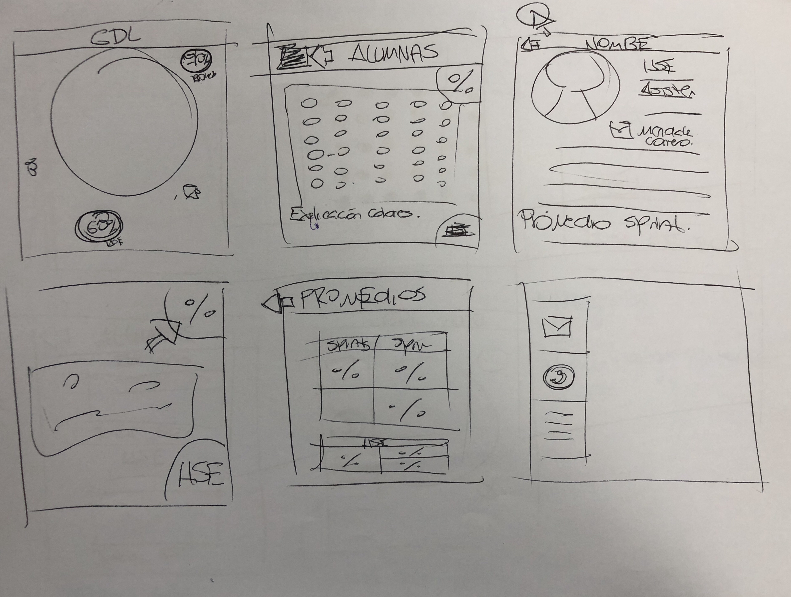

Prototipo

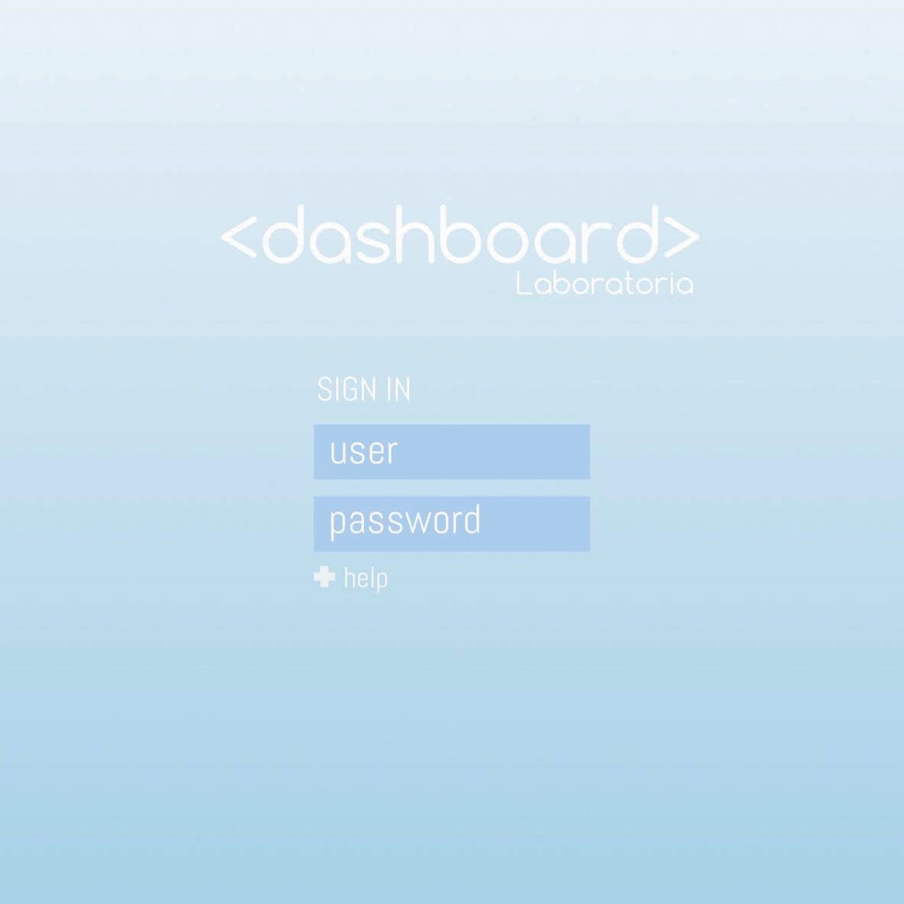
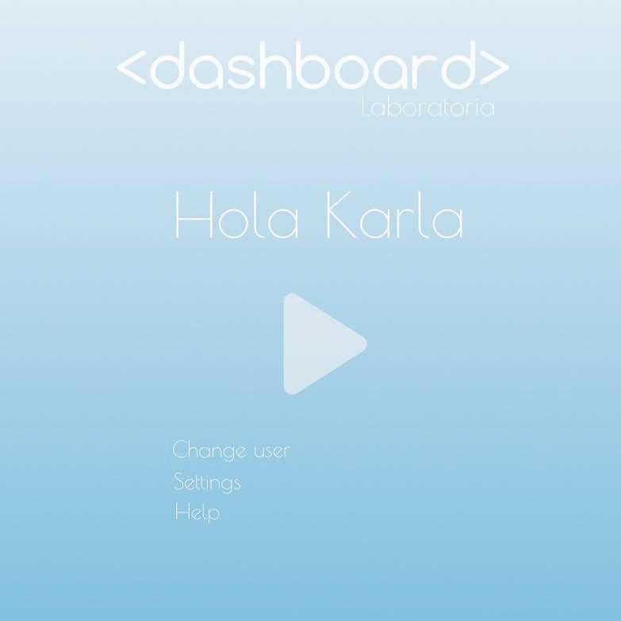

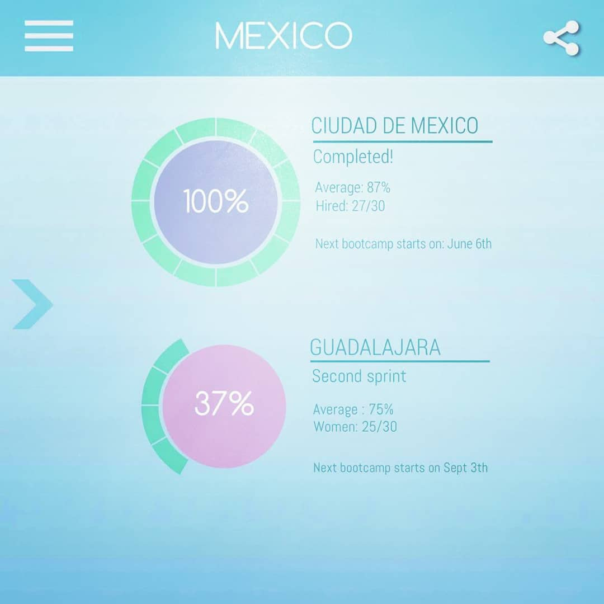

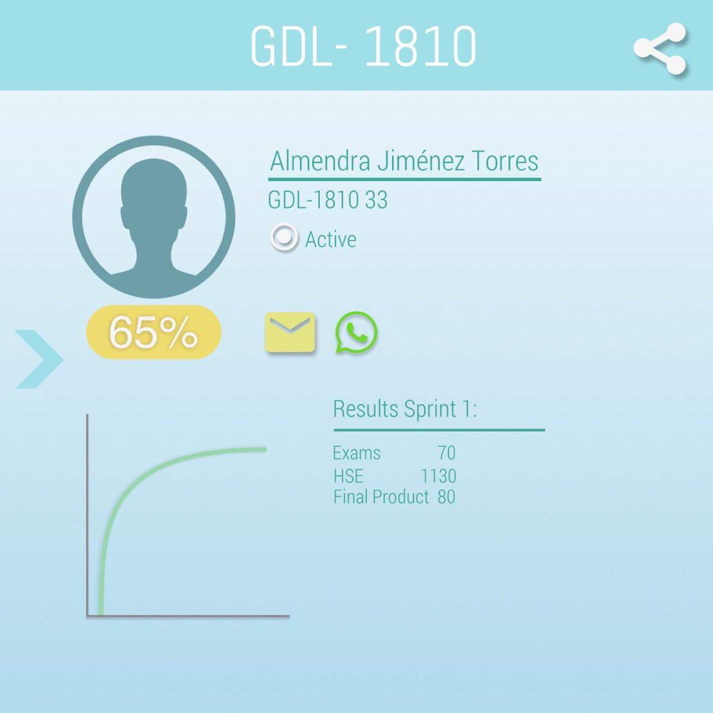

Después de la primer prueba se realizarón algunos cambios para que el producto fuera mas intuitivo.

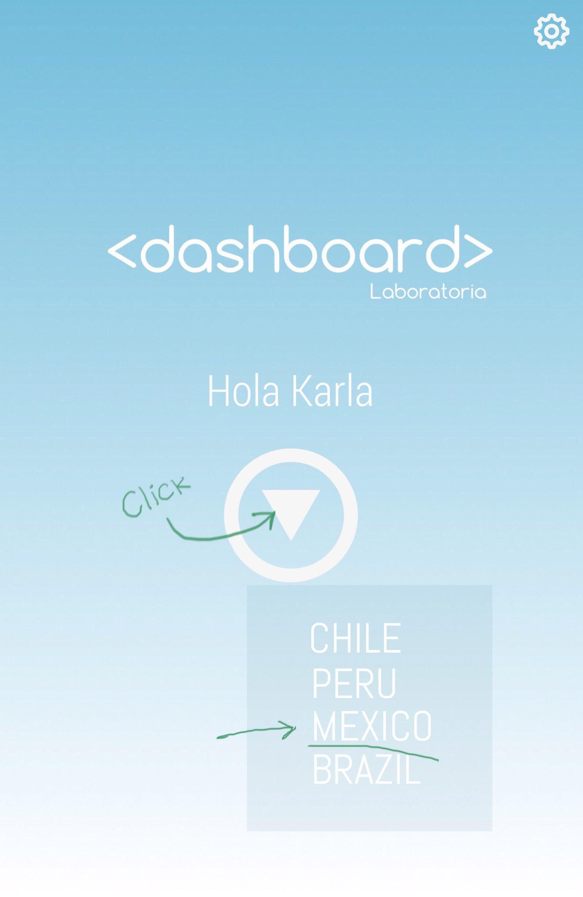
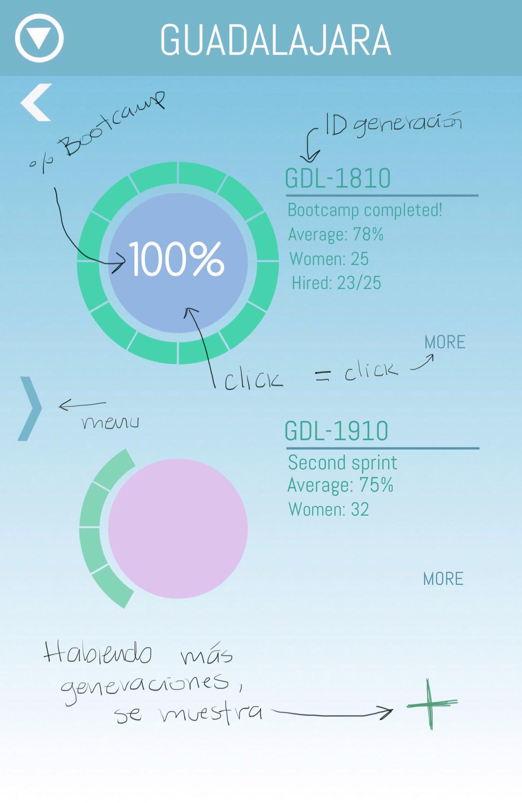
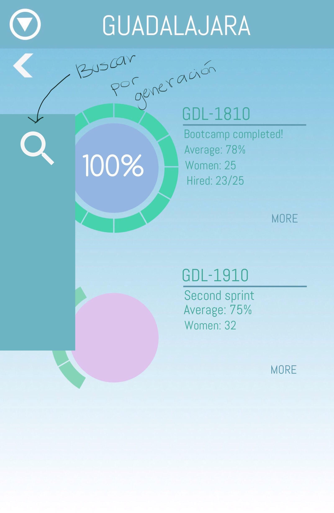
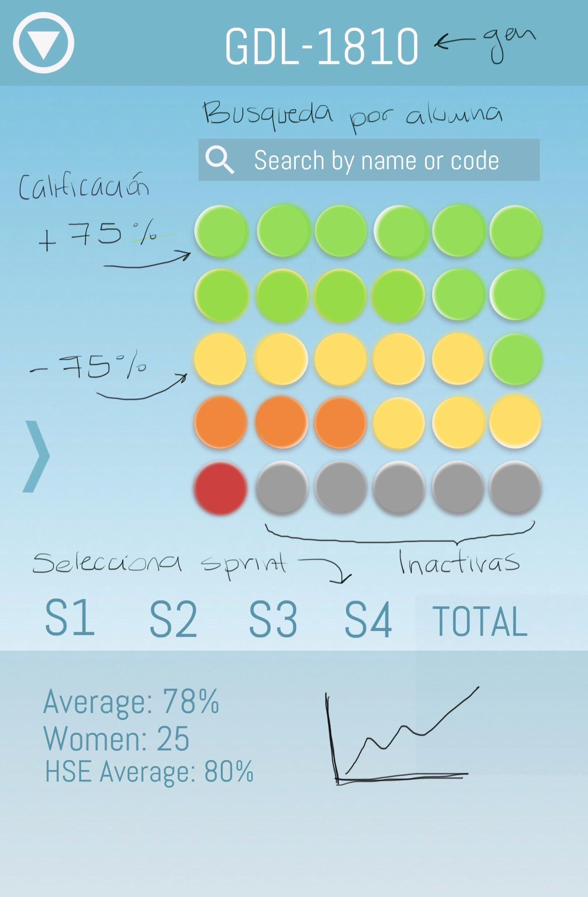
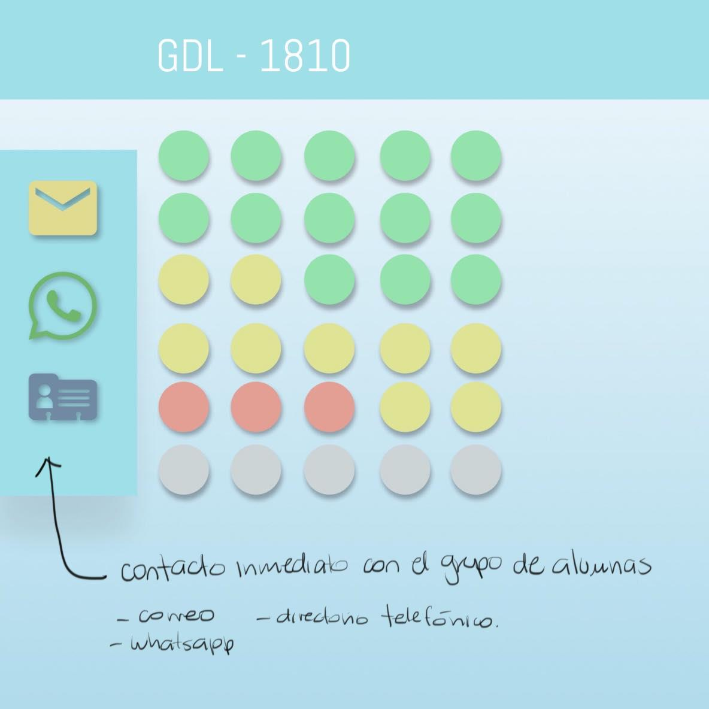
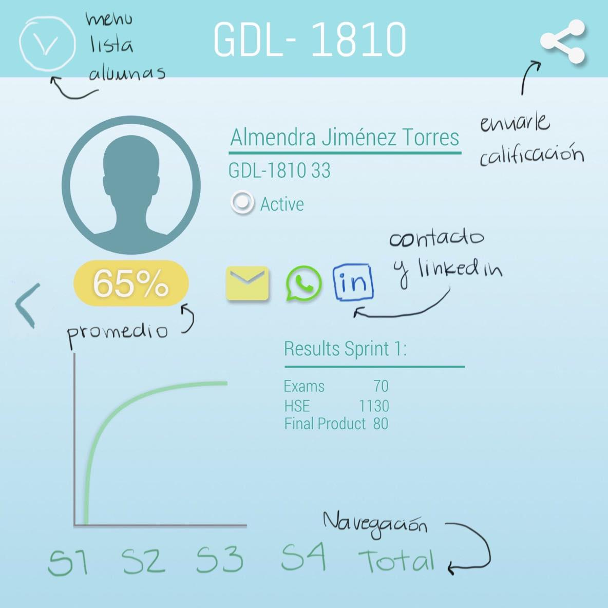

